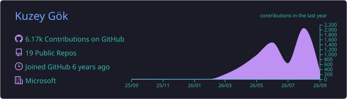
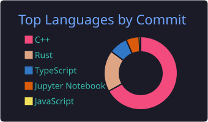
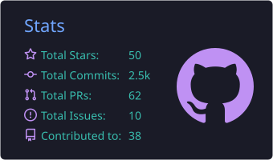

<h1 align="center">Kuzey Gök</h1>

  <b>Software Development Engineer at Microsoft</b> 
  Systems tooling, game tech, and ML from first principles

  
  
  
  
  
  

---

I usually end up here because an existing tool annoyed me enough to build my own. Right now I'm spending an unreasonable amount of time reverse-engineering Fallout 4's renderer, writing Rust tooling for mod development, and training language models from scratch.

## Projects

<h3>🎨 <a href="https://github.com/northaxosky/fallout4-community-shaders">fallout4-community-shaders</a>   </h3>

Reconstructing Fallout 4's rendering pipeline and bringing the Community Shaders model to the Creation Engine. Most days are C++, HLSL, runtime archaeology, and checking assumptions against the game.

<h3>🦀 <a href="https://github.com/northaxosky/overseer">overseer</a>   </h3>

A Fallout 4 mod manager in Rust, modeled on the parts of Mod Organizer 2 I actually want: non-destructive installs, transactional deploys, real load-order handling, useful diagnostics, and a terminal UI.

<h3>🧠 <a href="https://github.com/northaxosky/sky-ai">sky-ai</a>   </h3>

My from-scratch language-model work: a clean-room GPT-2 (124M) reproduction and the training stack around it. The point is to understand everything below `model.generate()`, not just call it.

<h3>🩹 <a href="https://github.com/Dear-Modding-FO4/Addictol">Addictol</a>   </h3>

Fallout 4 engine fixes maintained with [Dear Modding FO4](https://github.com/Dear-Modding-FO4): performance work, stability fixes, and crash patches collected in one plugin.

## Tech

  
  
  
  
  
  

  
  
  
  
  
  

  
  
  
  

## Stats

  

  
  

